# Newsfeed Application System

## Table of Contents

<details>
<summary><b>Table of Contents</b></summary>

1. [시스템 설계 개요](#1-시스템-설계-개요)
2. [코드 구조와 설계](#2-코드-구조와-설계)
   - 2.1 [멀티 모듈 구조](#21-멀티-모듈-구조)
   - 2.2 [모듈별 세부 구조](#22-모듈별-세부-구조)
   - 2.3 [핵심 설계 원칙](#23-핵심-설계-원칙)
   - 2.4 [모듈 간 호출 흐름](#24-모듈-간-호출-흐름)
     - 2.4.1 [회원가입](#241-회원가입)
     - 2.4.2 [로그인](#242-로그인)
     - 2.4.3 [포스트 생성](#243-포스트-생성)
     - 2.4.4 [뉴스피드 조회](#244-뉴스피드-조회)
     - 2.4.5 [팔로우](#245-팔로우)
   - 2.5 [메시지 큐 설계](#25-메시지-큐-설계)
     - 2.5.1 [RabbitMQ 코드 구조](#251-rabbitmq-코드-구조)
     - 2.5.2 [Topology 설계](#252-topology-설계)
     - 2.5.3 [Retry / Dead Letter 처리](#253-retry--dead-letter-처리)
3. [운영 인프라 구축과 배포](#3-운영-인프라-구축과-배포)
   - 3.1 [개요](#31-개요)
   - 3.2 [Naver Cloud Platform Configuration](#32-naver-cloud-platform-configuration)
   - 3.3 [ArgoCD 설치 및 연동](#33-argocd-설치-및-연동)
     - 3.3.1 [ArgoCD 설치](#331-argocd-설치)
     - 3.3.2 [ArgoCD 접속 설정](#332-argocd-접속-설정)
     - 3.3.3 [ArgoCD 웹 UI 접속](#333-argocd-웹-ui-접속)
   - 3.4 [Redis Cluster](#34-redis-cluster)
     - 3.4.1 [특징](#341-특징)
     - 3.4.2 [통신 방식](#342-통신-방식)
     - 3.4.3 [k8s 구축](#343-k8s-구축)

</details>

---

## 1. 시스템 설계 개요
- 참고: ⟨가상면접 사례로 배우는 대규모 시스템 설계 기초 1⟩ 11장

```mermaid
graph LR
    Client[Client]
    Gateway["🍃 API Gateway<br/>(JWT Auth + Routing)"]

    subgraph Microservices
        direction LR
        UserAPI[🍃 user-api]
        PostAPI[🍃 post-api]
        FanoutAPI[🍃 post-fanout-api]
        NewsfeedAPI[🍃 newsfeed-api]
        FriendAPI[🍃 friend-api]
    end

    subgraph MessageQueue ["Message Queue"]
        RabbitMQ[("RabbitMQ")]
    end

    subgraph Cache
        Redis[("Redis Cluster")]
    end

    subgraph Persistence
        direction LR
        MySQL[("MySQL<br/>(User DB / Post DB)")]
        Neo4j[("Neo4j<br/>(Friend Graph)")]
    end

    subgraph Observability
        Prometheus[("Prometheus<br/>(Metrics Monitoring)")]
        Grafana["Grafana<br/>(Metrics Visualization)"]
        FluentBit["FluentBit<br/>(Log Collector)"]
        ElasticSearch[("ElasticSearch<br/>(Log Storage)")]
        Kibana["Kibana<br/>(Log Search)"]
    end

    Client --> Gateway
    Gateway --> Microservices

    Microservices ~~~ MessageQueue
    Microservices ~~~ Cache

    Microservices --> RabbitMQ
    RabbitMQ --> Microservices

    Microservices --> Redis
    Microservices --> Persistence

    Microservices --> FluentBit
    Microservices --> Prometheus

    FluentBit --> ElasticSearch
    ElasticSearch --> Kibana
    Prometheus --> Grafana

    style Client fill:#ffd699,stroke:#333,stroke-width:2px,color:#000
    style Gateway fill:#e0e0e0,stroke:#333,stroke-width:2px,color:#000
    style UserAPI fill:#e0e0e0,stroke:#333,stroke-width:2px,color:#000
    style PostAPI fill:#e0e0e0,stroke:#333,stroke-width:2px,color:#000
    style FanoutAPI fill:#e0e0e0,stroke:#333,stroke-width:2px,color:#000
    style NewsfeedAPI fill:#e0e0e0,stroke:#333,stroke-width:2px,color:#000
    style FriendAPI fill:#e0e0e0,stroke:#333,stroke-width:2px,color:#000
    style RabbitMQ fill:#d9b3ff,stroke:#333,stroke-width:2px,color:#000
    style Redis fill:#ffb3b3,stroke:#333,stroke-width:2px,color:#000
    style MySQL fill:#b3e6b3,stroke:#333,stroke-width:2px,color:#000
    style Neo4j fill:#b3e6b3,stroke:#333,stroke-width:2px,color:#000
    style Prometheus fill:#ffe680,stroke:#333,stroke-width:2px,color:#000
    style Grafana fill:#ffe680,stroke:#333,stroke-width:2px,color:#000
    style ElasticSearch fill:#b3d9ff,stroke:#333,stroke-width:2px,color:#000
    style FluentBit fill:#b3d9ff,stroke:#333,stroke-width:2px,color:#000
    style Kibana fill:#b3d9ff,stroke:#333,stroke-width:2px,color:#000
```



---

## 2. 코드 구조와 설계

### 2.1 멀티 모듈 구조
```
nks-newfeed/
├── common/                    # 공통: exception, util, enums
├── common-api/                # API 계약 인터페이스 + FeignClient
├── common-security/           # JWT 인증/검증
├── repo/                      # 영속성 계층
│   ├── repo-user/            # MySQL User 엔티티
│   ├── repo-post/            # MySQL Post 엔티티
│   └── repo-friend/          # Neo4j 그래프 (팔로우 관계)
├── cache/                     # Redis 설정 및 서비스
├── messaging/                 # RabbitMQ 설정 및 이벤트
└── api/                       # 마이크로서비스
    ├── api-gateway/          # JWT 검증 + 라우팅
    ├── user-api/             # 회원가입/로그인
    ├── post-api/             # 포스트 CRUD
    ├── post-fanout-api/      # 포스트 팬아웃 (비동기 배포)
    ├── newsfeed-api/         # 뉴스피드 조회
    └── friend-api/           # 팔로우/언팔로우/추천
```

### 2.2 모듈별 세부 구조
```
common/
├── exception/        # 예외 클래스 및 글로벌 핸들러
├── util/             # 유틸리티 클래스
└── enums/            # 공통 Enum

common-api/
├── contract/         # API 계약 인터페이스
├── client/           # FeignClient 구현
└── dto/              # 요청/응답 DTO
    ├── request/
    └── response/

common-security/
└── (보안 및 JWT 관련 클래스)

repo/
├── repo-user/
│   ├── entity/        
│   └── repository/    
├── repo-post/
│   ├── entity/        
│   └── repository/    
└── repo-friend/
    ├── node/          
    ├── relationship/  
    └── repository/    

cache/
├── config/          # Redis 설정
└── service/         # 범용 Redis 연산

messaging/
├── config/          # RabbitMQ 설정
├── event/           # 이벤트 클래스
├── producer/        # EventPublisher
└── topology/        # exchange, queue binding 설정

api-gateway/
├── config/
├── filter/
└── handler/

user-api/
├── controller/
├── service/
├── consumer/
└── config/

post-api/
├── controller/
├── service/
└── config/

post-fanout-api/
├── consumer/
├── service/
└── config/

newsfeed-api/
├── controller/
├── service/
├── consumer/
└── config/

friend-api/
├── controller/
├── service/
├── consumer/
└── config/
```

### 2.3 핵심 설계 원칙
- **API 계약 우선**: `common-api`에 계약 인터페이스 정의 → RestController 구현 + FeignClient 상속
- **관심사 분리**: 영속성(repo), 캐싱(cache), 메시징(messaging)을 독립 모듈로 분리하여 각 기술 스택의 변경이 비즈니스 로직에 영향을 주지 않도록 설계
- **이벤트 기반 아키텍처**: 서비스 간 강결합을 피하고 RabbitMQ를 통한 비동기 통신으로 확장성과 장애 격리 확보

### 2.4 모듈 간 호출 흐름

#### 2.4.1 회원가입
```
Client
  ↓ POST /api/users/register
api-gateway (JWT 불필요 엔드포인트)
  ↓
user-api
  ├─ repo-user → MySQL User 저장
  ├─ messaging → UserCreatedEvent 발행
  └─ cache → Refresh Token 저장
       ↓
    RabbitMQ
       ↓
friend-api (Consumer)
  └─ repo-friend → Neo4j UserNode 생성
```

#### 2.4.2 로그인
```
Client
  ↓ POST /api/users/login
api-gateway
  ↓
user-api
  ├─ repo-user → 비밀번호 검증
  ├─ common-security → JWT 토큰 생성
  └─ cache → Refresh Token 저장
```

#### 2.4.3 포스트 생성
```
Client
  ↓ POST /posts (Authorization: Bearer {token})
api-gateway
  ├─ common-security → JWT 검증 및 userId 추출
  └─ X-User-Id 헤더 추가
       ↓
    post-api
      ├─ repo-post → MySQL Post 저장
      ├─ cache → 포스트 캐시 저장
      └─ messaging → PostCreatedEvent 발행
           ↓
        RabbitMQ
           ↓
    post-fanout-api (Consumer)
      ├─ FeignClient → friend-api 팔로워 목록 조회
      │                   └─ repo-friend → Neo4j FOLLOWS 관계 조회
      └─ cache → 각 팔로워의 뉴스피드에 postId 추가
```

#### 2.4.4 뉴스피드 조회
```
Client
  ↓ GET /newsfeed
api-gateway
  ├─ JWT 검증
  └─ X-User-Id 헤더 추가
       ↓
    newsfeed-api
      ├─ cache → 뉴스피드 postId 목록 조회 (Redis ZSet)
      └─ FeignClient → post-api 포스트 상세 조회
                         └─ cache → 캐시 조회
                         └─ repo-post → MySQL 조회 (캐시 미스 시)
```

#### 2.4.5 팔로우
```
Client
  ↓ POST /friends/follow
api-gateway
  ├─ JWT 검증
  └─ X-User-Id 헤더 추가
       ↓
    friend-api
      ├─ FeignClient → user-api 대상 사용자 존재 확인
      │                   └─ repo-user → MySQL 조회
      ├─ repo-friend → Neo4j FOLLOWS 관계 생성
      ├─ cache → 팔로워/팔로잉 캐시 무효화
      └─ messaging → FollowCreatedEvent 발행
           ↓
        RabbitMQ
           ↓
    newsfeed-api (Consumer)
      ├─ FeignClient → post-api 최근 포스트 조회
      └─ cache → 뉴스피드 백필 (과거 포스트 추가)
```

### 2.5 메시지 큐 설계

#### 2.5.1 RabbitMQ 코드 구조

**messaging 모듈**
- **event**: 이벤트 DTO 정의 (ex. `UserCreatedEvent`)
- **publisher**: 이벤트별 Publisher 클래스 (ex. `UserCreatedEventPublisher`)
  - 각 이벤트마다 독립적인 Publisher 존재
  - RabbitTemplate을 통해 메시지 발행
- **topology**: Exchange, Queue, Binding 인프라 선언 (ex. `UserCreatedEventTopology`)
  - 각 이벤트마다 독립적인 Topology 클래스 존재
  - Exchange는 이벤트별로 1개 생성 (ex. `ex.user.created.v1`)
  - Queue는 Consumer 마다 생성 (ex. `q.friend.user.created.v1`)
  - 멀티 컨슈머 구조에서 컨슈머 별로 재시도 및 Dead Letter 처리를 위해 Consumer 마다 DLX, DLQ 생성

**각 API 모듈**
- **consumer**: `@RabbitListener`로 메시지 소비 및 처리
  - Consumer는 각 API 모듈에서 구현 (ex. `friend-api`의 `UserCreatedEventConsumer`)
  - 각 Consumer는 Topology에 선언된 Queue를 구독

**설계 이유**
- **Publisher/Event/Topology를 messaging에 집중**: 메시징 인프라 변경 시 한 곳만 수정하면 되어 유지보수성 향상
- **Consumer를 각 API 모듈에 분산**: 각 서비스의 비즈니스 로직과 함께 배치하여 응집도 향상, 독립적인 배포 가능

#### 2.5.2 Topology 설계

**주요 컴포넌트**
- **Main Exchange**: delayed retry 지원을 위해 `x-delayed-message` 타입 사용
- **Main Queue**: `x-dead-letter-exchange` 설정으로 최대 재시도 실패 시 DLX로 자동 라우팅
- **DLX (Dead Letter Exchange)**: 실패 메시지를 DLQ로 라우팅
- **DLQ (Dead Letter Queue)**: 최대 재시도 실패한 메시지를 격리하여 수동 처리

**네이밍 규칙**
- **Exchange**: `ex.{domain}.{event}.{version}`
  - 예: `ex.user.created.v1`
- **Routing Key**: `{domain}.{event}`
  - 예: `user.created`
- **Main Queue**: `q.{consumer-service}.{domain}.{event}.{version}`
  - 예: `q.friend.user.created.v1`
- **DLX**: `dlx.{consumer-service}.{domain}.{event}.{version}`
  - 예: `dlx.friend.user.created.v1`
- **DLQ**: `dlq.{consumer-service}.{domain}.{event}.{version}`
  - 예: `dlq.friend.user.created.v1`

#### 2.5.3 Retry / Dead Letter 처리

- 2단계 재시도 전략 + DLQ

**(1) 1단계: Consumer level Retry**
- **목적**: 일시적인 실패(네트워크 지터, 순간적인 DB 락 등)에 즉시 대응
- **특징**:
  - `@Retryable` listener method 를 통해 Consumer 스레드 내에서 동기 재시도
  - 짧은 대기 시간(100ms → 200ms → 400ms)으로 스레드 점유 최소화
  - 빠른 복구 가능한 일시적 장애에 적합

**(2) 2단계: Broker level Retry (Delayed Message 재발행)**
- **목적**: 지속적인 장애(외부 서비스 다운, DB 연결 끊김 등)에 대응
- **동작 방식**:
  1. 1단계 재시도 모두 실패 시 RabbitListenerErrorHandler 구현체(`DelayedRetryErrorHandler`) 호출
  2. `x-retry-count` 헤더 확인 후 증가
  3. `x-retry-count` 값에 따라 `x-delay` 헤더에 지연 시간 설정
  4. 동일한 Exchange/RoutingKey로 메시지 재발행
  5. 원본 메시지 ACK (큐에서 제거)
  6. `x-delayed-message` Exchange가 설정 시간 후 Queue로 라우팅
- **특징**:
  - Consumer 스레드를 점유하지 않고 긴 대기 시간(5초 → 10초 → 20초) 동안 다른 메시지 처리 가능
  - 외부 시스템 복구 대기에 적합
  - RabbitMQ Delayed Message Exchange 플러그인 별도 설치 필요

**(3) Dead Letter 처리**
- 2단계 재시도까지 실패 시:
  - 메시지 NACK (requeue=false)
  - Main Queue의 `x-dead-letter-exchange` 설정에 의해 DLX로 자동 라우팅
  - DLX → DLQ로 최종 이동
  - DLQ 메시지는 모니터링 및 수동 처리 대상

---

## 3. 운영 인프라 구축과 배포

### 3.1 개요
- Ncloud Kubernetes Service 기반
  - 클러스터 전체 자원: vCPU 16EA, Memory 32GB
  - Naver Cloud Platform Application LoadBalancer (NCP ALB)를 Kubernetes Ingress 로 사용
  - Naver Cloud Platform BlockStorage 를 k8s Storage Class 로 사용
  - ArgoCD
- 메시지 큐 : Rabbit MQ Cluster / Spring AMQP
- 포스트, 사용자 정보, 뉴스 피드 캐시 : Redis Cluster
- 분산 애플리케이션 Rate Limiting : Redis Bucket4j
- 그래프 데이터베이스 : Neo4j
- 포스팅 / 사용자 정보 데이터베이스 : MySQL

### 3.2 Naver Cloud Platform Configuration
- Public NAT Gateway 생성 후 Private Subnet 을 위한 Route Table 에 모든 목적지 IP에 대한 NATGW Target Route를 추가해야 한다.
  - NKS Pod 들은 Private Subnet 안에 생성되기 때문에, 인터넷 아웃바운드 통신 (외부 레지스트리 접근 등)을 위해 필요하다.
- TCP 인바운드/아웃바운드 차단 규칙이 없어야 quay.io (container image registry of RedHat) 접속이 된다.

### 3.3 ArgoCD 설치 및 연동

#### 3.3.1 ArgoCD 설치
```bash
# ArgoCD namespace 생성
kubectl create namespace argocd

# ArgoCD 설치 (공식 매니페스트)
kubectl apply -n argocd -f https://raw.githubusercontent.com/argoproj/argo-cd/stable/manifests/install.yaml

# ArgoCD를 위한 NKS LoadBalancer (L4 수준) 서비스 생성
kubectl apply -f k8s/argocd/install.yaml
```

#### 3.3.2 ArgoCD 접속 설정
```bash
# ArgoCD admin 비밀번호 확인
kubectl -n argocd get secret argocd-initial-admin-secret -o jsonpath="{.data.password}" | base64 -d

# LoadBalancer 외부 IP 확인
kubectl get svc -n argocd argocd-server-lb
```

#### 3.3.3 ArgoCD 웹 UI 접속
- URL: `http://<LoadBalancer-External-IP>`
- Username: `admin`
- Password: 위에서 확인한 비밀번호

### 3.4 Redis Cluster

#### 3.4.1 특징
- Sharding: 키 공간을 hash slot 으로 나누어 각 노드에 분산 저장
  - 슬롯 재분배를 통해 수평 확장 가능
- High Availability: 각 마스터 노드마다 replica(슬레이브) 노드가 있어 failover 가능
  - 마스터 장애 발생 시 replica 중 하나가 majority vote 를 통해 새로운 마스터로 승격

#### 3.4.2 통신 방식
- 클러스터 내부 노드 간 통신 (Gossip Protocol)
  - 노드들이 주기적으로 자신의 상태(슬롯, 마스터 여부, 장애 여부 등)를 전파하며, 전파받은 노드들은 자신의 상태와 병합해서 다른 노드로 전파
  - Cluster Bus: TCP 16379 포트 사용
- 클라이언트와 노드 간 통신
  - redis cluster 는 프록시/라우터가 없어서 smart client (cluster-aware client) 필요
    - 클라이언트가 요청 키 기반으로 슬롯 번호를 계산하여, 적절한 마스터 노드로 요청을 보내야 함
    - 잘못된 노드로 요청을 보낼 경우 `MOVED <slot> <new_node>` 응답이 오므로 슬롯-노드 매핑 정보를 업데이트하고 다시 요청해야 함
    - 슬롯 재분배 중인 경우 `ASK <slot> <temp_node>` 응답이 오므로 임시 노드에 요청을 보내야 함
    - Redisson, JedisCluster, Lettuce 
  - TCP 6379 포트 사용

#### 3.4.3 k8s 구축
- 노드들이 서로를 인식하고 Redis Cluster 를 구성하려면 `redis-cli --cluster create ...`으로 클러스터를 초기화해야 함.
  - sts의 파드들이 모두 ready 상태가 되면 `cluster-init-job.yaml`을 실행
- Redis 노드의 안정적인 네트워크 ID와 순서 보장을 위해 sts 사용
  - `redis-cluster-0`, `redis-cluster-1` 등 고정된 pod 이름 생성
  - 클러스터 노드 간 상호 인식을 위한 DNS 이름 필요
- Headless Service: `ClusterIP: None`으로 설정된 서비스로, 일반적인 서비스와 달리 로드밸런싱을 하지 않고 sts 파드들의 개별 DNS 레코드 생성
  - `redis-cluster-0.redis-cluster-headless.nks-infrastructure.svc.cluster.local`
  - 클러스터 초기화 시 각 노드의 IP 주소 확인에 필요
- PodDisruptionBudget: 클러스터 가용성 보장
  - 최대 1개 pod까지만 동시 중단 허용 (`maxUnavailable: 1`)
  - 노드 업그레이드나 유지보수 시 서비스 중단 최소화

##### 파드 볼륨 구성

- redis-data (volumeClaimTemplate)
  - 용도: Redis 데이터 영속 저장소 (`/data` 마운트)
  - 타입: PersistentVolumeClaim (각 pod마다 독립된 5Gi NKS Block Storage)
  - 특징: pod 재시작/재스케줄링 시에도 데이터 유지

- redis-config (ConfigMap 볼륨)
  - 용도: Redis 설정파일 제공 (`/etc/redis` 마운트)
  - 내용: `redis.conf` (cluster-enabled, maxmemory 정책 등)
  - 특징: 모든 pod가 동일한 설정 공유

##### 클러스터 초기화 여부 확인
```bash
# 클러스터 상태 확인
kubectl exec -n nks-infrastructure redis-cluster-0 -- redis-cli cluster info

# 노드 구성 확인 (3 마스터 + 3 슬레이브)
kubectl exec -n nks-infrastructure redis-cluster-0 -- redis-cli cluster nodes

0056c160ba3841d145bf61632ff5207afca270ca 198.18.1.95:6379@16379 slave f582a1892f7b7875415da46a16d38d2dc2d8cbcb 0 1755445454981 1 connected
10cf6a4ddaec2a8e0ab99e9ab4c0d57a1a168445 198.18.0.38:6379@16379 master - 0 1755445457992 2 connected 5461-10922
8372f8094d6036cfbbf3879cf280c25a72e13d10 198.18.0.169:6379@16379 slave 10cf6a4ddaec2a8e0ab99e9ab4c0d57a1a168445 0 1755445456988 2 connected
54ef56306a3182b611b05c28c25b026628a76339 198.18.1.113:6379@16379 master - 0 1755445453000 3 connected 10923-16383
f582a1892f7b7875415da46a16d38d2dc2d8cbcb 198.18.1.27:6379@16379 myself,master - 0 1755445449000 1 connected 0-5460
773d814c6a7cc3e6fafaad34584dde46eb02d869 198.18.0.204:6379@16379 slave 54ef56306a3182b611b05c28c25b026628a76339 0 1755445455984 3 connected
```
